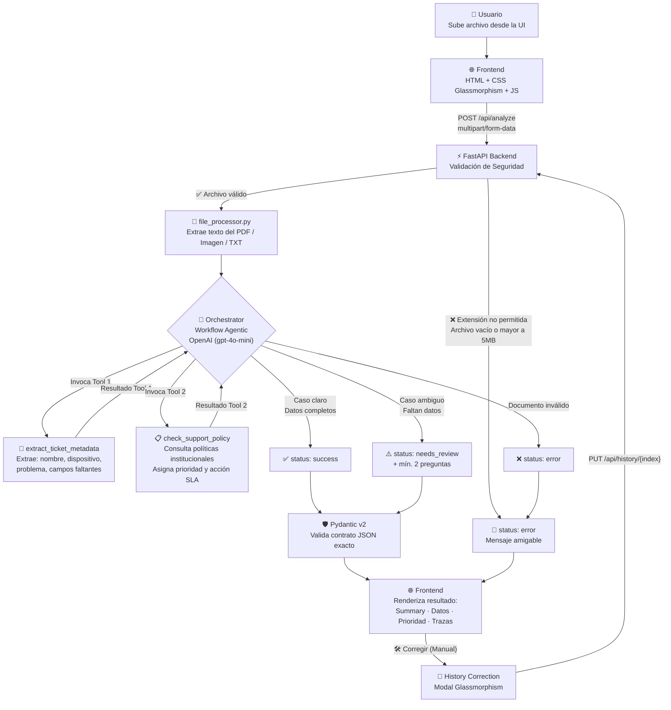

# Support Intake AI 🤖

> Sistema inteligente de análisis y clasificación de tickets de soporte técnico con IA.  
> Utiliza un **Workflow Agentic** con **LLM** (OpenAI), **Tool Calling** y **Structured Output** validado por Pydantic.

---


## Arquitectura del Sistema



---

## Estructura del Repositorio (Clean Architecture)

```
├── backend/
│   ├── app/
│   │   ├── api/
│   │   │   └── routes/tickets.py           # Endpoints FastAPI: POST /analyze, GET /history, PUT /history
│   │   ├── application/
│   │   │   ├── use_cases/
│   │   │   │   └── analyze_ticket_use_case.py # Workflow Agentic: orquesta la IA y Tools
│   │   │   └── file_processor.py           # Lógica de extracción (TXT, PDF, Imágenes)
│   │   ├── domain/
│   │   │   └── models.py                   # Pydantic: Modelos y Enums estrictos
│   │   ├── infrastructure/
│   │   │   ├── llm/
│   │   │   │   └── groq_client.py          # Cliente Async (compatible con Groq/OpenAI)
│   │   │   ├── persistence/
│   │   │   │   └── ticket_repository.py    # Persistencia en JSON (ticket_history.json)
│   │   │   └── tools/
│   │   │       ├── check_support_policy.py    # Tool: Políticas institucionales SLA
│   │   │       └── extract_ticket_metadata.py # Tool: Extracción inicial explícita
│   │   └── main.py                         # Entrypoint FastAPI, CORS y StaticFiles
│   ├── .env                                # Credenciales (NO subir a GitHub)
│   ├── .env.example                        # Template seguro
│   └── requirements.txt
│
├── frontend/
│   ├── index.html                          # UI interactiva y Layout general
│   ├── style.css                           # Diseño premium dark glassmorphism
│   └── js/
│       ├── api/api.js                      # Peticiones Fetch al backend
│       ├── state/store.js                  # Estado global reactivo y cálculos de métricas
│       ├── ui/
│       │   ├── render.js                   # Funciones para DOM (toasts, tablas, resultados)
│       │   └── traffic_light.js            # Render del componente Semáforo de prioridades
│       └── main.js                         # Orchestrator frontend y eventos DOM
│
├── samples/
│   ├── caso_claro.txt
│   ├── caso_ambiguo.txt
│   └── caso_invalido.txt
│
└── README.md
```

---

## Instalación y Configuración

### Requisitos Previos
- Entorno de ejecución: **Python 3.11** o superior.
- Credenciales: Clave de autenticación (API Key) para el servicio multimodal de **OpenAI** (disponible en [platform.openai.com](https://platform.openai.com/api-keys)).

---

### Fase A: Primera Instalación (Setup Inicial)

Si es la primera vez que clona o configura el proyecto en el equipo, deben ejecutarse estos pasos para aprovisionar el ecosistema:

1. **Ubicarse en el módulo servidor (Backend) e inicializar el contenedor virtual:**
   ```bash
   cd backend
   python -m venv venv
   
   # Activación del entorno virtual (Windows PowerShell):
   .\venv\Scripts\Activate.ps1
   ```

2. **Instalación de las librerías dependientes del núcleo:**
   ```bash
   pip install -r requirements.txt
   ```

3. **Variables de Entorno y Seguridad:**
   Generar el manifiesto de configuración local a partir de la plantilla y asignar las credenciales:
   ```bash
   copy .env.example .env
   ```
   > **Importante:** Es imperativo editar el archivo `.env` manual o programáticamente para declarar el valor en la variable `OPENAI_API_KEY`. Por normativas de ciberseguridad corporativa, este archivo no se versiona.

4. **Primer despliegue local:**
   ```bash
   uvicorn app.main:app --reload --port 8000
   ```

---

### Fase B: Arranque Habitual (Sesiones Posteriores)

Una vez que el proyecto base ya fue configurado en pasos anteriores, bastará con reactivar el entorno aislado y lanzar las operaciones asíncronas para operar el sistema de inmediato.

1. **Reactivar entorno e iniciar Uvicorn:**
   ```bash
   cd backend
   .\venv\Scripts\Activate.ps1
   uvicorn app.main:app --reload --port 8000
   ```

---

### Acceso a Plataformas (API & UI)

Una vez provisto del servidor Uvicorn de forma exitosa (sea en Fase A o Fase B), el ecosistema web unifica los accesos:

- **Documentación OpenAPI (Swagger)**: `http://127.0.0.1:8000/docs`
- **Interfaz de Usuario (Capa Frontend)**: El ecosistema renderiza de forma centralizada la experiencia gráfica dinámica a través de la ruta `http://127.0.0.1:8000/ui/`. Acceder a la raíz lógica (`http://127.0.0.1:8000`) aplicará un redireccionamiento automático resolviendo nativamente las peticiones estáticas.

---

## Flujo del Sistema

| Paso | Componente | Acción |
|------|------------|--------|
| 1 | **Frontend** | Usuario sube un archivo (drag & drop o clic) |
| 2 | **JS (cliente)** | Valida extensión, tamaño máx 5MB y nombre seguro |
| 3 | **FastAPI** | Valida extensión allowlist, tamaño, y archivo no vacío |
| 4 | **`file_processor`** | Extrae texto del PDF / imagen (base64) / TXT |
| 5 | **`orchestrator`** | LLM invoca **Tool 1**: `extract_ticket_metadata()` |
| 6 | **`orchestrator`** | LLM invoca **Tool 2**: `check_support_policy()` |
| 7 | **LLM** | Evalúa resultados y genera JSON estructurado |
| 8 | **Pydantic v2** | Valida que el JSON cumpla el contrato exacto |
| 9 | **Frontend** | Renderiza: resumen, datos, prioridad, advertencias, trazas |
| 10 | **Control Calidad** | Usuario puede **"Corregir"** datos manualmente y actualizar KPIs |

---

## Herramientas del Workflow (Tool Calling)

### Tool 1 — `extract_ticket_metadata`
Extrae y evalúa la completitud de los campos del ticket.  
**Entradas:** `reporter_name`, `device_or_system`, `problem_description`, `missing_fields[]`  
**Salidas:** Campos estructurados + `has_minimum_data` + `completeness_score` (0–4)  
**Siempre se invoca primero.**

### Tool 2 — `check_support_policy`
Consulta la base de datos de políticas institucionales (28 categorías) para asignar prioridad y acción SLA.  
**Entradas:** `problem_description`, `device_or_system`  
**Salidas:** `priority` (Crítica / Alta / Media / Baja), `suggested_action`, `matched_keyword`

---

## Contrato de Salida (Structured Output)

La API retorna **siempre** este JSON validado por Pydantic:

```json
{
  "status": "success | needs_review | error",
  "document_type": "support_document",
  "summary": "Resumen breve del ticket",
  "extracted_data": {
    "reporter_name": "...",
    "device_or_system": "...",
    "problem_description": "...",
    "priority": "Crítica | Alta | Media | Baja",
    "suggested_action": "..."
  },
  "warnings": [],
  "needs_clarification": false,
  "clarifying_questions": [],
  "tool_trace": [
    { "tool": "extract_ticket_metadata", "reason": "...", "success": true },
    { "tool": "check_support_policy",    "reason": "...", "success": true }
  ],
  "edited_by_human": false
}
```

### Endpoint de Actualización (Historial)
`PUT /api/history/{index}`
Permite corregir manualmente un ticket procesado. Actualiza el campo `edited_by_human` para trazabilidad y métricas.

---

## Validación de Escenarios de Uso

| # | Archivo | Resultado Esperado |
|---|---------|-------------------|
| 1 | `samples/caso_claro.txt` | `status: success` · datos completos · sin preguntas |
| 2 | `samples/caso_ambiguo.txt` | `status: needs_review` · `needs_clarification: true` · ≥ 2 preguntas |
| 3 | `samples/caso_invalido.txt` | `status: error` · mensaje amigable · sin crash |

---

## Seguridad Informática

| Área | Medida |
|------|--------|
| **Credenciales** | API key en `.env`, nunca en código. `.env.example` sin valores reales |
| **Archivos** | Allowlist: `.pdf .png .jpg .jpeg .txt` · Máx 5 MB · Sin almacenamiento en disco |
| **Errores** | Backend nunca expone stack traces al cliente |
| **CORS** | Solo orígenes `localhost` permitidos |
| **XSS** | Frontend usa `escapeHtml()` en todos los datos del API antes de renderizar |
| **Alucinaciones** | LLM instruido explícitamente a no inventar datos ausentes |
| **Path traversal** | Validación de nombre de archivo en el cliente |

---

## Stack Tecnológico

| Capa | Tecnología |
|------|-----------|
| **Frontend** | HTML5 · CSS3 Glassmorphism · Vanilla JavaScript |
| **Backend** | Python 3.11+ · FastAPI |
| **Validación** | Pydantic v2 (`model_validator`) |
| **LLM** | OpenAI `gpt-4o-mini` (tool calling nativo y visión) |
| **Extracción** | `pdfplumber` (PDFs) · Base64 + Vision API (imágenes) |
| **Secretos** | `python-dotenv` |

---

## Métricas y KPIs de IA
El sistema incluye un tablero de control para medir el desempeño:
- **IA Directa (100%)**: Tickets resueltos sin intervención.
- **Corregidos (Humano)**: Tickets que requirieron ajuste manual para cerrar el ciclo de atención.
- **Semáforo de Prioridades**: Componente visual que clasifica en tiempo real los incidentes sin depender de librerías externas.
